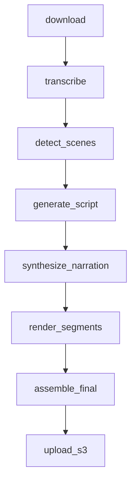

# Trailer Breakdown Service — Design Spec

**Date:** 2026-06-13  
**Status:** Approved (brainstorming)  
**Integration:** New feature module in existing monorepo (`backend/src/trailer/` + `frontend/src/features/trailer-breakdown/`)

---

## Summary

A new **Trailer Breakdown** feature lets users paste a YouTube trailer URL and receive an auto-generated breakdown video suitable for posting on a YouTube analysis channel. The output follows the popular **voiceover breakdown** format: trimmed trailer clips with AI-written narration, scene labels, and on-screen text overlays — the style used by channels like Mr. Sunday Movies, ScreenCrush, and New Rock.

---

## Goals

1. Paste a YouTube video URL → download trailer automatically
2. Analyze trailer (transcript + scene cuts)
3. Generate a structured breakdown script via GPT
4. Render a 16:9 1080p MP4 with TTS voiceover over trailer clips
5. Preview, edit script, re-render, download, or publish via existing YouTube OAuth

## Non-Goals (v1)

- Frame zoom / circle highlights on specific pixels
- Face-cam picture-in-picture
- Non-YouTube sources (direct MP4 upload deferred to v1.1)
- Auto YouTube chapter timestamps
- Vertical 9:16 shorts format

---

## User Flow

```
1. User navigates to Trailer Breakdown in sidebar
2. Pastes YouTube URL (+ optional movie title)
3. Clicks "Generate Breakdown"
4. Job runs in background; UI polls status with stage/progress
5. On completion: preview video + view/edit breakdown script segments
6. Optional: edit narration text → re-render
7. Download MP4 or publish to connected YouTube channel
```

---

## Architecture

### Pattern

Mirror the existing **story-video** async job pattern:

```
HTTP Controller (thin) → Service (business logic) → Queue → Pipeline worker
```

### Backend module layout

```
backend/src/trailer/
├── controllers/trailerBreakdownController.ts
├── services/trailerBreakdownService.ts
├── pipeline/
│   ├── queue.ts
│   └── run.ts
├── io/youtubeDownload.ts          # NEW: yt-dlp wrapper
├── ai/trailerAnalysis.ts          # GPT breakdown script generation
└── render/assembleBreakdown.ts    # clip cut + overlays + mux
```

### Reused infrastructure

| Capability | Source |
|------------|--------|
| Whisper transcription | `story/ai/openaiStory.ts` |
| Scene detection | `story/scene/detectFacade.ts` |
| TTS narration | `story/narration/ttsNarration.ts` |
| FFmpeg clip/concat/mux | `story/render/ffmpeg.ts`, `common/utils/ffmpeg.ts` |
| S3 storage + presigned URLs | `common/services/s3Storage.ts` |
| OpenAI credentials | `common/services/settingsService.ts` |
| YouTube publish | `common/services/platforms/youtubeService.ts` |
| Job lifecycle pattern | `StoryVideoJob` model + `story/pipeline/queue.ts` |

### New infrastructure

| Component | Detail |
|-----------|--------|
| `yt-dlp` | Added to `backend/Dockerfile`; wrapped in `youtubeDownload.ts` |
| `TrailerBreakdownJob` | New Mongoose model |
| GPT prompts | Trailer-specific structured JSON output in `trailerAnalysis.ts` |
| Render assembler | Breakdown-specific segment assembly in `assembleBreakdown.ts` |

---

## API

**Base path:** `/api/trailer-breakdown`  
**Auth:** JWT via `authMiddleware`  
**Rate limit:** New limiter (same pattern as `storyVideoLimiter`)

| Method | Path | Purpose |
|--------|------|---------|
| `POST` | `/create` | Create job from `{ youtubeUrl, movieTitle?, options? }` |
| `GET` | `/jobs` | List user's jobs (paginated) |
| `GET` | `/:jobId/status` | Status, stage, progress, events |
| `GET` | `/:jobId/result` | Breakdown script + output video URL |
| `PATCH` | `/:jobId/script` | Update breakdown script segments |
| `POST` | `/:jobId/render` | Re-render after script edits |
| `POST` | `/:jobId/cancel` | Cancel in-flight job |
| `POST` | `/:jobId/retry` | Retry failed job |
| `GET` | `/:jobId/play` | Presigned playback URL for output MP4 |

### Response shape

Follow existing convention:

```typescript
// Success
{ success: true, data?: T, url?: string }
// Error
{ success: false, error: string, hint?: string }
```

---

## Data Model

### `TrailerBreakdownJob` (Mongoose)

```typescript
type TrailerBreakdownJobStatus =
  | 'pending'
  | 'processing'
  | 'completed'
  | 'failed'
  | 'cancelled';

interface BreakdownSegment {
  id: string;
  startSec: number;       // timestamp in source trailer
  endSec: number;
  label: string;          // e.g. "Opening shot", "Villain reveal"
  narration: string;      // TTS voiceover text
  onScreenText?: string;  // lower-third overlay
}

interface TrailerJobOptions {
  ttsProvider: 'inherit' | 'openai' | 'elevenlabs';
  exportPreset: 'fast' | 'balanced' | 'quality';
  sceneDetectionMode: 'ffmpeg' | 'pyscenedetect' | 'hybrid';
  narrationLanguage: string;  // default 'en'
}

interface TrailerIntermediateMeta {
  workDir?: string;
  sourceVideoPath?: string;
  transcriptJson?: string;
  sceneCutsJson?: string;
  breakdownScriptJson?: string;
  narrationAudioPath?: string;
  clipsDir?: string;
  finalPath?: string;
}

interface ITrailerBreakdownJob {
  userId: ObjectId;
  idempotencyKey: string;
  status: TrailerBreakdownJobStatus;
  stage: string;
  progressPercent: number;
  progressMessage: string;
  attempts: number;
  maxAttempts: number;
  cancelRequested: boolean;
  events: { at: Date; stage: string; message: string }[];

  youtubeUrl: string;
  movieTitle?: string;
  options: TrailerJobOptions;
  breakdownScript: BreakdownSegment[];

  intermediate: TrailerIntermediateMeta;
  outputVideoUrl?: string;
  outputS3Key?: string;
  error?: string;

  createdAt: Date;
  updatedAt: Date;
}
```

---

## Pipeline

### Stages



| Stage | Input | Output | Notes |
|-------|-------|--------|-------|
| `download` | YouTube URL | `source.mp4` in workDir | yt-dlp, max 5 min timeout, best ≤1080p |
| `transcribe` | source audio | timed transcript segments | Whisper `verbose_json` via openaiStory |
| `detect_scenes` | source video | scene cut timestamps | detectFacade (ffmpeg default) |
| `generate_script` | transcript + scenes + title | `breakdownScript[]` | GPT-4o-mini structured JSON |
| `synthesize_narration` | script segments | per-segment + merged audio | TTS via ttsNarration |
| `render_segments` | source + script + audio | clip files in clipsDir | cut, pad/trim to narration length, burn label |
| `assemble_final` | clip files | `output.mp4` | concat + mux narration, x264 1080p |
| `upload_s3` | output.mp4 | presigned URL + S3 key | same pattern as story-video |

### GPT script generation

**Input to GPT:**
- Trailer transcript with timestamps
- Scene cut list
- Optional movie title (or inferred from yt-dlp metadata)
- Target: 8–15 breakdown segments

**Output JSON schema:**

```json
{
  "title": "Movie Name — Trailer Breakdown",
  "segments": [
    {
      "id": "seg-1",
      "startSec": 0.0,
      "endSec": 4.5,
      "label": "Cold open",
      "narration": "We open on a wide shot of...",
      "onScreenText": "Opening Scene"
    }
  ]
}
```

**Prompt guidelines:**
- Hook in first segment (grab attention in ≤10 seconds of narration)
- Identify characters, plot hints, Easter eggs, visual callbacks
- Reference specific timestamps/dialogue from transcript
- End with subscribe/CTA segment
- Narration should be conversational analysis tone, not recitation of dialogue

### Render logic (per segment)

1. Cut trailer clip from `[startSec, endSec]`
2. Measure TTS audio duration for segment narration
3. If clip shorter than narration: hold last frame (tpad) or slow slightly
4. If clip longer than narration: trim from end
5. Burn in `onScreenText` as lower-third (reuse drawtext from `common/utils/ffmpeg.ts`)
6. Mux segment narration audio

Final assembly: concat all segment videos → single MP4 with continuous narration track.

### Resume / retry

- Persist intermediate artifacts to `intermediate` field (JSON paths in workDir)
- On retry: skip stages whose output files already exist
- `cancelRequested` checked between stages

---

## Frontend

### Module: `frontend/src/features/trailer-breakdown/`

| File | Purpose |
|------|---------|
| `api.ts` | API client functions |
| `pages/TrailerBreakdownLibrary.tsx` | Job list |
| `pages/TrailerBreakdownEditor.tsx` | Create job, progress, script editor, preview |
| `components/BreakdownScriptEditor.tsx` | Editable segment list |
| `components/JobProgress.tsx` | Stage/progress display |

### Routes

| Path | Component |
|------|-----------|
| `/trailer-breakdown` | Library |
| `/trailer-breakdown/:jobId` | Editor |

### Sidebar

Add nav item **Trailer Breakdown** in `Sidebar.tsx`.

### UI behavior

- **Create form:** YouTube URL input, optional movie title, generate button
- **Progress:** Stage name + percent bar (poll every 3s while processing)
- **Result:** Video player + segment list with editable narration/labels
- **Actions:** Re-render, download, publish (reuse publish flow from Publishing page)

---

## Infrastructure Changes

### Dockerfile

Add `yt-dlp` installation:

```dockerfile
RUN pip install yt-dlp
# or: RUN curl -L https://github.com/yt-dlp/yt-dlp/releases/latest/download/yt-dlp -o /usr/local/bin/yt-dlp && chmod +x /usr/local/bin/yt-dlp
```

### app.ts

```typescript
app.use('/api/trailer-breakdown', authMiddleware, trailerBreakdownLimiter, createTrailerBreakdownRoutes(env));
```

### Worker

- **Dev:** In-process `void runTrailerBreakdownJob(jobId)` (same as story-video local mode)
- **Prod:** Optional Lambda handler `lambda/trailerBreakdownWorkerHandler.ts` mirroring story worker

### Environment

No new secrets. Uses existing:
- `OPENAI_API_KEY` (per-user via settings)
- S3 bucket config
- YouTube OAuth credentials

---

## Error Handling

| Error | Behavior |
|-------|----------|
| Invalid YouTube URL | Fail at create with validation message |
| Private/deleted video | Fail at download stage with clear error |
| Download timeout (>5 min) | Fail with retry option |
| Whisper/GPT failure | Retry once; fail with partial data saved |
| TTS failure | Fail segment; allow script edit + re-render |
| FFmpeg failure | Fail with stderr excerpt in job error field |
| Worker crash | Resume from intermediate on retry |

---

## Security & Legal

- YouTube download via yt-dlp is for user's own content creation workflow; user accepts responsibility for fair use
- Rate limit job creation (default: 10/hour per user)
- Validate URL domain (youtube.com, youtu.be only in v1)
- Work dirs cleaned up after S3 upload (configurable retention)

---

## Testing Strategy

| Layer | Tests |
|-------|-------|
| `youtubeDownload.ts` | Unit test with mocked yt-dlp spawn |
| `trailerAnalysis.ts` | Unit test with mocked OpenAI response + JSON validation |
| `assembleBreakdown.ts` | Integration test with short sample MP4 |
| Service | Create/status/result API tests |
| E2E | Manual: paste real trailer URL → verify output plays |

---

## Implementation Phases

### Phase 1 — Core pipeline (MVP)

- DB model + API create/status/result
- yt-dlp download
- Whisper + scene detect + GPT script
- TTS + basic render (clips + labels + concat)
- Frontend: create + progress + preview

### Phase 2 — Edit & publish

- Script editor + re-render endpoint
- Download + YouTube publish integration
- Job list/library page

### Phase 3 — Polish

- Retry/cancel/resume
- Lambda worker for production
- Better overlay styling (fonts, animations)

---

## Open Questions (resolved)

| Question | Decision |
|----------|----------|
| Output format | Voiceover breakdown (Option A) |
| Integration | New module in monorepo (Option A) |
| Aspect ratio | 16:9 1080p |
| Auto-publish | Manual preview first; publish button uses existing OAuth |
